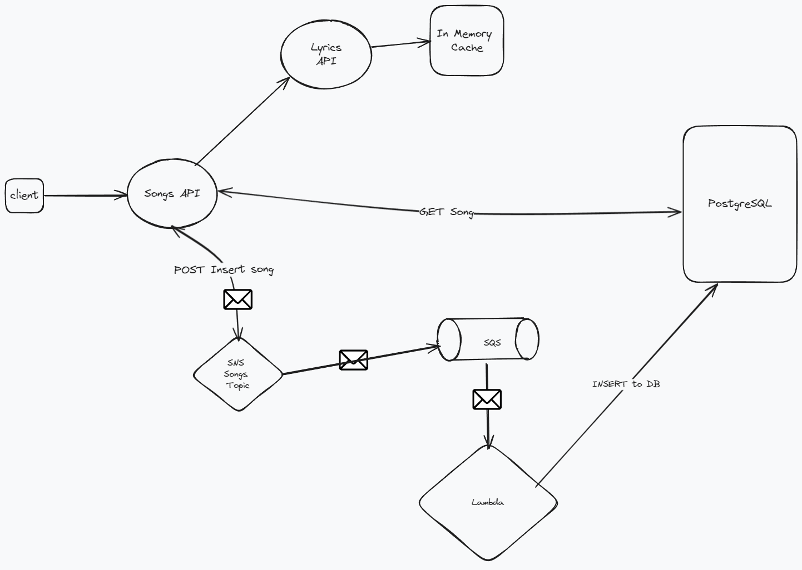

### BackEnd Exam

# Structure and Endpoints

Project contain 3 microservioces, Postgress DB, Kafka
Also added Postman collection for testing the APIS

## Songs-server

1. GET - song - search songs by name of song and artist
2. POST - insertJob - create new Job to add song by song name and artist Used for insert songs in asyncronous job, post request to add song as a producer for message in the tpopic 'insert_song_jobs'
3. GET - insertJobStatus - send an insertJobId to get the status of the proccess from DB with status success or failed and information .
4. Using Middleware to validate request with class validator

## Consumer-worker

Used to consume messages as a microservice, and send songs data from messages into the DB

## Lyrics-server

Service that return lyrics for songName - I assume that data will not change so added in-memory cache for it, and with large scale probably will use a more robust solution (such as Redis)

## DB

Needed to make some DB changes to handle requirements

1. Add PK,SERIAL to index number id. (The index field should be auto generated)
2. Efficent search by adding index for song name+artist
3. Add unique constraint - a song can’t be inserted in case there is already a song with the same name and artist
4. Add new Table insert_song_job for get jobs status and info
